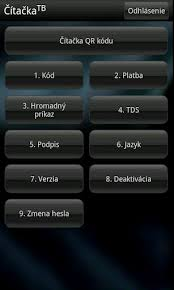
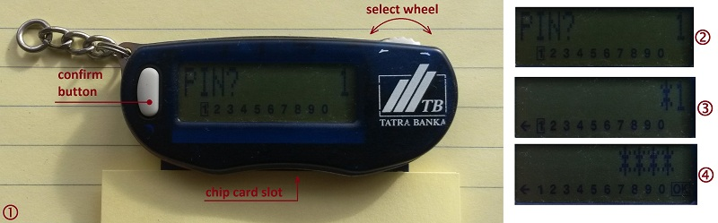

# Hall of Fame/Shame

### The Goal
The goal of this study is to provide a critique on selected security/privacy user interface usability.

### Interface of choice
[Tatra](http://www.tatrabanka.sk/en/) bank uses for authentification into their internet banking [One Time Password](http://en.wikipedia.org/wiki/One-time_password) (OTP).

There are two ways how to obtain OTP:

* mobile application (see Figure 1);
* chip card readers, which come in two flavors:
    * full size (see Figure 2);
    * key chain size (see Figure 3).

|  |  |  | 
|:---:|:---:|:---:|
| *Figure 1:* Mobile Application | *Figure 2:* Full size | *Figure 3:* Key chain size |

__*I this study we will look at the key chain size card reader and only at the PIN entry process to generate OTP.*__

### Login Process - general steps for the card reader
To log into the internet banking you need:

1. open the bank's internet banking site in your browser;
2. provide your user name and password;
3. at this point if, user name and password were verified; you will be requested to enter One Time Password;
4. to do so, insert your card issued by the bank (credit or debit card that contains chip) into the card reader slot;
5. from the menu select OTP option;
6. enter PIN;
7. type generated code into website field.
8. if valid, you will be logged in.

### PIN entry
At this point we will look only at the PIN entry part of the process. Please follow Figure 4.

|  |
|:---:|
| *Figure 4:* |

Due to the small size of the reader there are only two input "buttons" (see Figure 4: pict. 1):

1. select wheel,
2. and confirm button.

At this point we would like to positively comment on hardware:
* Select wheel isn't a free wheel. It requires a "right amount" of force to turn it and it provides an excellent tactile feedback, along with quiet mechanical "CLICK" sound, after each move. It allows moving between choices very precisely. Wheel moves in both directions which minimizes number of moves.
* Confirm button again requires a "right amount" of force to press it to avoid unwanted selections. The response is again tactile, but now without any hearable mechanical "CLICK".

First "screen" for entering PIN contains menu of 10 numbers with the focus on digit 1 (see Figure 4: pict. 2):

    [1] 2 3 4 5 6 7 8 9 0
    
You are selecting numbers by scrolling left or right with the wheel. If you reach left or right end of the menu you can still continue in chosen direction and focus will move to the opposite side of the menu. It rolls around. When the focus, rectangle around the digit; is on the right number press button to confirm it.

When the first digit is selected (by the wheel) and confirmed (by the button) on the left side of the menu will appear the back arrow which works as a backspace. Focus is still on the last number selected. (see Figure 4: pict. 3):

    ← [1] 2 3 4 5 6 7 8 9 0

If the first number is deleted (by that backspace) arrow will disappear.

After 4th selected and confirmed number, on the rights side of the menu will appear the OK button which will immediately take the focus. (see Figure 4: pict. 4):

    ← 1 2 3 4 5 6 7 8 9 0 [OK]

If you are happy with the entered PIN you can straight confirm it with the button, without any scrolling. And if you are not happy, backspace is only one wheel move away. If you delete that 4^th^ PIN number OK button will disappear.

### Summary

**Pros:**

* menu system minimizes the number of necessary moves by the wheel with appearing and disappearing unnecessary menu items and clever [OK] autofocus.
* hardware finish of the wheel and button provide an excellent feedback to move precisely in the menu and to avoid any unwanted clicks.

**Cons:**

* it's almost impossible or at least impractical to use it with one hand only. If the wheel was "press-able" and fulfills also the button role, it would be possible to use it with one hand and maybe the device could be even smaller. However that probably could be more error prone.
* device is oriented for a right-handed users.
* display, due to the battery life; doesn't have any backlight so it's harder to read the numbers in worse light conditions. It might be a problem for visually impaired users.
* also this is not a device for blind users as the only tactile or audio feed back is the mechanical click of the wheel.
